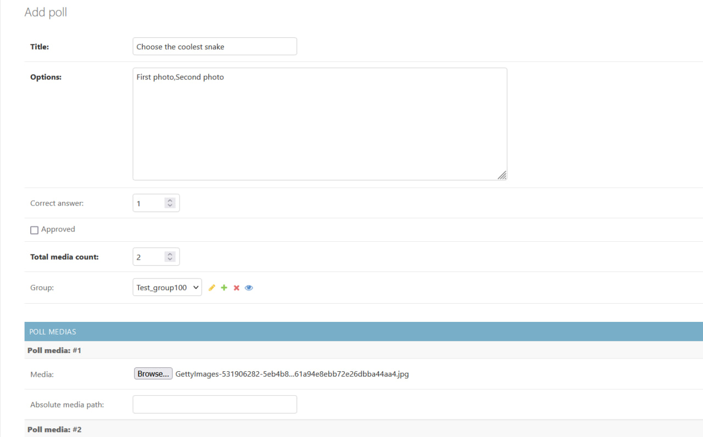

# Установка
**1.** git clone [https://github.com/Dbtzhv/leasing_bot.git](https://github.com/Dbtzhv/leasing_bot.git)  
**2.** переходим в склонированную папку в консоли и выполняем команду: python -m venv venv. Потом активируем виртуальное окружение 
**3.** устанавливаем зависимости в виртуальное окружение: pip install -r requirements.txt  
**4.** создаём суперюзера: python manage.py createsuperuser  
**5.** переходим в bot/bot.py и вставляем токен своего бота в переменную bot = Bot('') (уже вставлен на бота @AitrixCarBot). Токен можно получить у @BotFather  
**6.** запускаем сервер django, находясь папке leasing_bot: python manage.py runserver  
**7.** открываем вторую консоль, переходим в leasing_bot/bot и запускаем бота: python main.py  
**8.** смотрим проект

# Рассылка 

Для начала, нужно перейти в bot/bot.py и вписать свой admin_id (тот айди пользователя, которому будут приходить рассылки на подтверждение).
Потом переходим в админку, заходим суперюзером и создаем рассылки (посты - POSTS, викторина и опрос - POLLS)
Пример создания POLLS:

В total_media_count нужно ввести количество медиа, которое будет у поста/викторины/опроса 
correct_answer - какой по номеру option будет правильным (если оставить пустым, то будет обычный опрос без правильного ответа). Счёт начинается с 1 
absolute_media_path оставляем пустым, он заполнится автоматически. Главное - загрузить сами фотки. 
После save сообщение отправится указанному admin_id, он нажимёт "Подвтердить" и у него в админке поменяется поле approved(подтверждено) на True и начнётся рассылка
